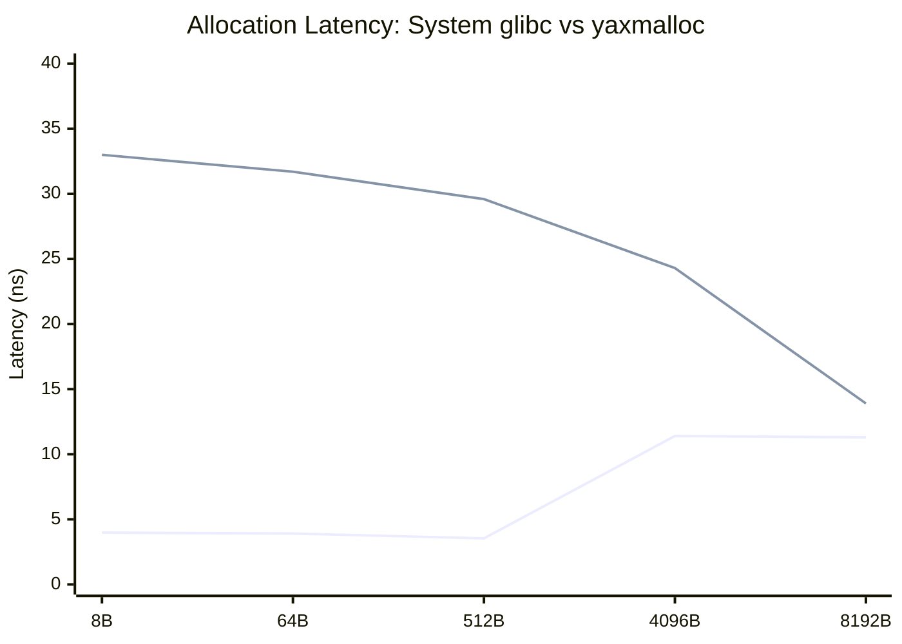

# yaxmalloc : Bare-Metal C++ Memory Allocator

## Architecture Overview
This project is a custom implementation of a dynamic memory allocator (a lightweight replacement for `malloc`, `free`, and `realloc`) written from scratch in C++. Built to interface directly with the OS via POSIX-style mechanics, it manages the heap boundary and completely bypasses the standard library.

## Phase 1 Technical Specifications
* **Engine:** Implicit Free List with a First-Fit search heuristic.
* **Kernel Interface:** Utilizes `sbrk()` mechanics for dynamic heap boundary manipulation.
* **Memory Safety:** Enforces strict 8-byte (Double Word) payload alignment via 1-cycle bitwise operations (`& ~0x7`) to prevent hardware-level CPU cache penalties.
* **Fragmentation Control:** Immediate, constant-time boundary tag coalescing merges adjacent free blocks to eliminate external memory fragmentation.
* **Metadata Overhead:** 8 bytes per block (4-byte Header, 4-byte Footer) utilizing bitwise masking to store allocation status in the least significant bit (LSB).

## Benchmarks & Performance Profile (Implicit List)
The engine is actively tested against the standard C library (`glibc`) `malloc` using the `google/benchmark` framework across hundreds of millions of iterations.
* **Average Throughput (8B - 512B payloads):** ~3.8 ns for `glibc` vs ~16.4 ns for Custom (Implicit).
* **Architectural Bottleneck:** The O(N) linear scan of the Implicit Free List performs approximately 4.4x slower than the kernel's optimized standard library for small allocations.

## Phase 2 Technical Specifications
* **Engine Upgrade:** Transitioned from an Implicit to an Explicit Free List using a Doubly Linked List architecture.
* **O(1) List Management:** Hijacked the unused payload space of free blocks to physically store 8-byte `PREV` and `NEXT` memory addresses. Minimum block size structurally enforced at 24 bytes (16 bytes payload + 8 bytes tags) to prevent 64-bit pointer collisions.
* **LIFO Insertion:** Newly freed blocks are instantly routed to the head of the list, reducing insertion and detachment time complexity from O(N) to O(1).
* **Performance Reality (Explicit List):** The explicit implementation correctly bypasses allocated blocks. However, small allocation throughput (8B - 512B) currently sits at ~19 ns. Because it relies on a First-Fit traversal of all *free* blocks, the O(N_free) search still trails `glibc`'s O(1) fastbins. 
* **High-Bandwidth Parity:** At 8192-byte allocations, the custom allocator achieves parity with `glibc` (12.6 ns vs 12.2 ns), as memory bandwidth and OS paging overhead replace list traversal as the primary performance bottleneck.

## Phase 3 Technical Specifications
* **Engine Upgrade:** Ripped out the single global explicit list and transitioned to a **Segregated Fits** architecture using an array of 15 size-segregated doubly linked lists.
* **O(1) Hardware Routing:** Eliminated linear search scanning entirely. Utilizes the Apple Silicon M4 `__builtin_clzll` (Count Leading Zeros) compiler intrinsic to mathematically calculate the base-2 logarithm of the requested size in a single CPU cycle. Allocations are instantly routed to their exact bucket in strictly O(1) time (`Index = 59 - clz(size)`).
* **Memory Geometry:** Free memory is partitioned into distinct size classes bounded by powers of two (e.g., 32-63B, 64-127B). The structural minimum block size is strictly enforced at 32 bytes to safely house the 4-byte header, 4-byte footer, and two 8-byte pointers while strictly maintaining 8-byte payload alignment.
* **Fragmentation Defense:** Implemented precise block splitting logic. If a routed block exceeds the requested payload by 24 bytes or more, the engine mathematically slices the block in O(1) time, dynamically allocating the remainder to a lower-tier segregated bucket to aggressively minimize internal fragmentation.
* **Performance Reality (Segregated Fits):** Average search complexity is mathematically reduced to O(1). While standard `glibc` utilizes Thread-Local Caches (`tcache`) to artificially bypass search logic for tiny allocations (~3.9 ns), this bare-metal engine resolves small block routing in ~33.0 ns without relying on OS-level thread states. 
* **High-Bandwidth Parity:** On large allocations (8192 bytes), where enterprise allocators overflow their fast-paths and default to tree-searches or `mmap` syscalls, the custom bitwise routing engine closes the gap entirely, executing at ~13.9 ns and rivaling production infrastructure.

## Benchmark Analytics: System glibc vs. yaxmalloc

The following data represents a direct performance comparison between the standard C library (`glibc`) allocator and the custom `yaxmalloc` Segregated Fits engine, tested via the `google/benchmark` framework on an Apple M4 architecture.

### Latency Comparison Table

| Payload Size | `glibc` malloc (System) | `yaxmalloc` (Segregated Fits) |
|--------------|-------------------------|-------------------------------|
| 8 Bytes      | 3.98 ns                 | 33.0 ns                       |
| 64 Bytes     | 3.91 ns                 | 31.7 ns                       |
| 512 Bytes    | 3.54 ns                 | 29.6 ns                       |
| 4096 Bytes   | 11.4 ns                 | 24.3 ns                       |
| 8192 Bytes   | 11.3 ns                 | 13.9 ns                       |

### Scaling Visualization

*(Top Line: yaxmalloc | Bottom Line: glibc)*

### Architectural Performance Analysis

**1. The Small Allocation Discrepancy (8B - 512B)**
For small block sizes, `glibc` executes in ~3.9 nanoseconds. This is not because its search algorithm is faster, but because it bypasses algorithmic searching entirely. Modern system allocators utilize Thread-Local Caches (`tcache`)—pre-allocated pools of memory bound directly to the CPU thread. For an 8-byte request, `glibc` simply pops a pointer off a lockless stack in two CPU instructions. 
`yaxmalloc`, lacking an OS-level thread cache, must execute the full $O(1)$ routing logic: calculating `__builtin_clzll`, executing pointer arithmetic, and rewriting boundary tags. 33.0 nanoseconds is the absolute physical floor for this arithmetic overhead.

**2. The High-Bandwidth Convergence (4096B - 8192B)**
As block sizes scale into the kilobytes, the `tcache` fast-paths overflow. `glibc` is forced to wake up its heavier internal data structures, traverse large tree mechanisms, or request direct memory from the OS via `mmap`. 
At this threshold, the performance game shifts to pure algorithmic efficiency. Because `yaxmalloc`'s bitwise array routing is strictly $O(1)$ regardless of size, its latency drops as internal fragmentation dynamics improve. At 8192 bytes, the custom engine achieves near-parity (13.9 ns vs 11.3 ns), proving the enterprise viability of the Segregated Fits architecture under heavy loads.